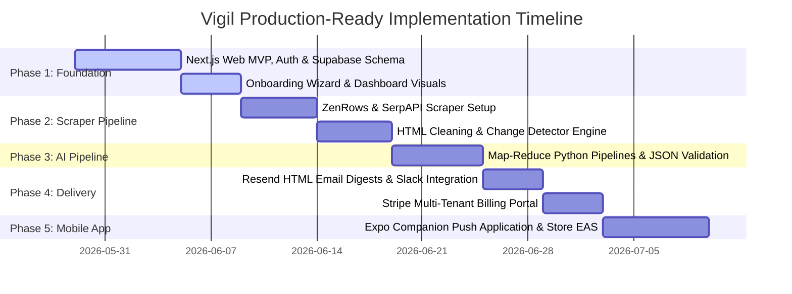

# Vigil — The AI Competitive Intelligence Co-Pilot for SMBs

## 1. Executive Summary & Product Vision

### The Problem
Big companies have dedicated competitive intelligence teams using expensive enterprise tools like Crayon, Klue, or Kompyte. Small and mid-sized businesses (SMBs) fly blind. They rely on manual Google Alerts, occasional peeks at competitor websites, and gut feel. When a competitor launches a new feature, changes pricing, or runs a new ad campaign, SMBs find out weeks later—often after losing customers.

There is no lightweight, AI-native, fully automated competitive intelligence SaaS that works reliably without an army of analysts or high-maintenance infrastructure.

### The Product
**Vigil** is a SaaS platform where a user feeds their company’s name, website, and value proposition. The platform automatically discovers competitors (including indirect ones), then continuously monitors their entire public digital footprint. An AI engine analyzes the data, filters out the noise, and delivers a weekly executive summary with the three to five things the user actually needs to know, plus urgent real-time alerts for high-impact competitor moves.

Vigil is **web-first for analytical work** (managing competitors, reviewing complex diffs, exporting SWOTs) with a **mobile companion app** and **weekly email briefs** for proactive delivery.

---

## 2. Tech Stack

### Web Application (Primary Interface)
| Layer | Choice | Rationale |
|---|---|---|
| Framework | Next.js (React) | Standard for B2B SaaS, excellent SEO, fast page loads, API routes, App Router structure |
| Styling | TailwindCSS + shadcn/ui | Premium, customizable, highly responsive components with cohesive aesthetics |
| Charts | Recharts | Rich, interactive charting for desktop data visualization |
| State Management | React Context / SWR | Server-state caching and simple data-fetching orchestration |

### Companion Mobile App
| Layer | Choice | Rationale |
|---|---|---|
| Framework | React Native + Expo | Cross-platform iOS/Android, rapid iteration, file-based Expo Router |
| State Management | Zustand | Lightweight, TypeScript-first, zero-boilerplate client state |
| UI Components | React Native Paper + NativeWind | Consistent utility-first styling matching the web dashboard |
| Notifications | Expo Push Notifications | Simple native push alerts |

### Backend & Database
| Layer | Choice | Rationale |
|---|---|---|
| BaaS / Database | Supabase | PostgreSQL engine, built-in Auth, Row-Level Security (RLS), Realtime database listeners |
| Serverless Functions | Supabase Edge Functions | Lightweight API webhooks, Stripe billing integration, notification dispatchers |
| Scheduled Jobs | pg_cron (Supabase) | Triggers background queue synchronization |

### Scraping & Monitoring Engine (The Scraping API Layer)
To ensure reliable, block-free scraping at scale, Vigil delegates the actual web requests to professional evasion APIs.
| Layer | Choice | Rationale |
|---|---|---|
| Scraper Runtime | Python + FastAPI | Clean parsing (BeautifulSoup, lxml), rich async ecosystem, simple API hosting |
| Task Queue | Celery + Redis | Asynchronous, distributed task processing with rate-limiting support |
| Evasion Proxy API | **ZenRows** or **ScrapingBee** | Bypasses Cloudflare, Akamai, PerimeterX, CAPTCHAs, and IP bans using rotating residential proxies and stealth browser fingerprints |
| Job Board Search | **SerpAPI (Google Jobs)** | Standardized parsing of LinkedIn, Indeed, and Google Jobs without bot blocks |
| Deployment | Railway (Worker Tier) | Easily scales Celery workers and Redis separately from database infrastructure |

### AI / LLM Pipeline
| Service | Purpose | Cost Optimization Strategy |
|---|---|---|
| OpenAI GPT-4o-mini | Map-Reduce analysis pipeline, alert triage | Extreme low cost, highly reliable structured JSON output |
| OpenAI Text-Embeddings-3-small | Semantic competitor discovery and search | Negligible cost, fast vector generation |

---

## 3. Data Model (Supabase Tables)

### `users`
| Column | Type | Notes |
|---|---|---|
| id | UUID (PK) | Supabase Auth UID |
| email | TEXT | Unique user email |
| company_name | TEXT | User's business name |
| company_url | TEXT | User's company domain |
| description | TEXT | 1-sentence value proposition used in prompts |
| plan_tier | TEXT | 'free', 'pro', 'business', 'enterprise' |
| created_at | TIMESTAMPTZ | Timestamp |

### `competitors`
| Column | Type | Notes |
|---|---|---|
| id | UUID (PK) | Unique ID |
| user_id | UUID (FK → users) | Tenant separation |
| name | TEXT | Competitor company name |
| domain | TEXT | Competitor primary website domain |
| logo_url | TEXT | Cached company logo |
| status | TEXT | 'tracking', 'paused', 'discovered' |
| discovered_by | TEXT | 'ai' or 'manual' |
| ai_confidence | FLOAT | AI similarity score (0-1) |
| created_at | TIMESTAMPTZ | Timestamp |

### `competitor_sites`
| Column | Type | Notes |
|---|---|---|
| id | UUID (PK) | Unique ID |
| competitor_id | UUID (FK → competitors) | Reference |
| url | TEXT | Verified URL (e.g., pricing, careers) |
| page_type | TEXT | 'homepage', 'pricing', 'product', 'careers', 'blog' |
| last_hash | TEXT | MD5 hash of normalized, noise-filtered text |
| last_checked_at | TIMESTAMPTZ | Timestamp |
| created_at | TIMESTAMPTZ | Timestamp |

### `website_changes`
| Column | Type | Notes |
|---|---|---|
| id | UUID (PK) | Unique ID |
| competitor_id | UUID (FK → competitors) | Reference |
| site_id | UUID (FK → competitor_sites) | Reference |
| detected_at | TIMESTAMPTZ | Timestamp |
| change_summary | TEXT | LLM-summarized change explanation |
| diff_text | TEXT | Clean, structured Markdown diff |
| severity | TEXT | 'low', 'medium', 'high' |
| created_at | TIMESTAMPTZ | Timestamp |

### `job_postings`
| Column | Type | Notes |
|---|---|---|
| id | UUID (PK) | Unique ID |
| competitor_id | UUID (FK → competitors) | Reference |
| role | TEXT | Job title |
| department | TEXT | 'Engineering', 'Sales', 'Product', 'Marketing', etc. |
| url | TEXT | Link to job posting |
| posted_at | DATE | Extracted post date |
| detected_at | TIMESTAMPTZ | Timestamp |
| is_new | BOOLEAN | Flagged for daily/weekly digest |
| created_at | TIMESTAMPTZ | Timestamp |

### `reviews`
| Column | Type | Notes |
|---|---|---|
| id | UUID (PK) | Unique ID |
| competitor_id | UUID (FK → competitors) | Reference |
| source | TEXT | 'g2', 'trustpilot', 'capterra', 'reddit', 'google' |
| rating | FLOAT | 1.0 - 5.0 |
| title | TEXT | Review headline |
| snippet | TEXT | Review content excerpt |
| sentiment | TEXT | 'positive', 'neutral', 'negative' |
| author | TEXT | Reviewer details |
| date | DATE | Date of posting |
| url | TEXT | Link to original review |
| detected_at | TIMESTAMPTZ | Timestamp |
| created_at | TIMESTAMPTZ | Timestamp |

### `ad_campaigns`
| Column | Type | Notes |
|---|---|---|
| id | UUID (PK) | Unique ID |
| competitor_id | UUID (FK → competitors) | Reference |
| platform | TEXT | 'google', 'meta', 'linkedin' |
| headline | TEXT | Ad headline |
| body | TEXT | Ad text copy |
| cta | TEXT | Call-to-action button text |
| landing_url | TEXT | Ad landing page URL |
| launched_at | DATE | Date first detected |
| detected_at | TIMESTAMPTZ | Timestamp |
| created_at | TIMESTAMPTZ | Timestamp |

### `alerts`
| Column | Type | Notes |
|---|---|---|
| id | UUID (PK) | Unique ID |
| user_id | UUID (FK → users) | Tenant ID |
| competitor_id | UUID (FK → competitors) | Reference |
| severity | TEXT | 'info', 'medium', 'high', 'critical' |
| category | TEXT | 'pricing', 'product', 'hiring', 'marketing', 'reputation' |
| title | TEXT | Actionable headline |
| body | TEXT | Bulleted breakdown of impact |
| is_read | BOOLEAN | Read flag |
| source_type | TEXT | Target table name (e.g. 'website_changes') |
| source_id | UUID | FK to the source row |
| created_at | TIMESTAMPTZ | Timestamp |

### `weekly_briefs`
| Column | Type | Notes |
|---|---|---|
| id | UUID (PK) | Unique ID |
| user_id | UUID (FK → users) | Tenant ID |
| week_start | DATE | Date of the Monday of the brief |
| bullets | JSONB | 3-5 structured weekly takeaways |
| swot_analysis | JSONB | Standard SWOT framework JSON |
| raw_analysis | TEXT | Original LLM reduced pipeline output |
| generated_at | TIMESTAMPTZ | Timestamp |
| is_sent | BOOLEAN | Email notification success flag |
| created_at | TIMESTAMPTZ | Timestamp |

---

## 4. Web Dashboard & Navigation (Next.js)

The Next.js Web Dashboard is the primary visual and analytical control center for Vigil.

### Navigation Structure
```
web/
├── app/
│   ├── (auth)/
│   │   ├── sign-in/page.tsx       ← Sleek auth cards (OAuth / Supabase email)
│   │   └── sign-up/page.tsx       ← Registration layout
│   ├── onboarding/
│   │   └── page.tsx               ← Step-by-step company setup wizard
│   ├── (dashboard)/
│   │   ├── layout.tsx             ← Collapsible sidebar navigation container
│   │   ├── dashboard/page.tsx     ← Central feeds, summaries, and action panels
│   │   ├── competitors/
│   │   │   ├── page.tsx           ← Advanced tracked competitors list table
│   │   │   └── [id]/page.tsx      ← In-depth multi-tab analysis dashboard
│   │   ├── alerts/
│   │   │   └── page.tsx           ← Filterable real-time intelligence alerts log
│   │   ├── briefs/
│   │   │   ├── page.tsx           ← Archived analyst memos directory
│   │   │   └── [weekId]/page.tsx  ← Comprehensive weekly overview & SWOT
│   │   └── settings/
│   │       └── page.tsx           ← Billing (Stripe), crawl frequency, integrations
```

### Screen Details

#### 4.1 Onboarding Wizard — `/onboarding`
A full-screen onboarding wizard designed with high-quality visual steps to drive the "Aha!" moment.
* **Step 1: Brand Definition:** Simple forms to input:
  - Business website domain (auto-fetches metadata).
  - Business name.
  - Short description of value proposition and ideal customer profile (ICP).
* **Step 2: AI Competitor Discovery (The Magic Step):** While user waits, an embedded loading skeleton states: *"Vigil is searching global indexes for competitors..."* 
  - Resolves into a gorgeous **grid of suggested competitors** (fetched via embedding vector similarity).
  - Each card lists: Logo, Domain, Similarity Confidence Score (e.g., 94%), and a dynamic **"Why we selected them"** description paragraph detailing overlapping keywords/offerings.
  - Interactive checkboxes allow users to bulk-select/deselect suggested competitors. A "Add manual competitor URL" bar sits at the bottom.
* **Step 3: Resource Config:** Option toggles to choose active scrapers (Websites, Jobs, Reviews, Advertising campaigns).
* On completion: Routes directly to `/dashboard`.

#### 4.2 Dashboard Panel — `/dashboard`
The primary home panel displaying real-time metrics and digests.
* **Metric Cards Strip:** Clean grid displaying:
  - Active Tracked Competitors count.
  - Major Changes detected this week.
  - High-Severity alerts triggered.
  - Crawl health status.
* **Weekly Intelligence Brief Card:** Designed like a luxury analyst memo. 
  - Display the 3-5 Map-Reduced bullet takeaways. Each bullet card includes: Category tag (Pricing, Hiring, Product), Competitor name tag, actionable response tip, and click-through link to deep-dive.
* **Real-time Alert Strip:** Horizontal scroller displaying high-severity alerts as glowing badges.
* **Competitor Summary Grid:** Cards for all tracked competitors showing:
  - Competitor logo + status indicator dot (Green = Quiet, Yellow = Minor Changes, Red = High Impact pricing/product pivots detected).
  - Activity sparkline.
  - Quick launch buttons: "Trigger crawler now", "View detail analytics".

#### 4.3 Competitor Analytics Table — `/competitors`
An advanced shadcn-ui data table allowing managers to control their monitoring lists.
* **Search and Category Filter bar:** Quick-filter by tracking status (`Tracking`, `Paused`, `Awaiting Review`).
* **Interactive Controls:** Toggle switch columns to quickly pause/unpause scraper workers for specific competitor domains.
* Columns detailing: Name, Domain, Date Tracked, Activity Level (changes/week), Status, Action button.

#### 4.4 Competitor Deep-Dive — `/competitors/[id]`
A dense, multi-tab data panel rendering structured metrics.
* **Header:** Displays logo, domain link, tracking health status, and quick export to PDF button.
* **Tab 1: Overview:**
  - AI Competitor Summary card summarizing the company's positioning.
  - Key metrics: Average sentiment rating, active job posts count, active advertising campaigns count.
* **Tab 2: Web Changes Visualizer:**
  - Left pane: Interactive timeline of change history.
  - Right pane: **Sleek Side-by-Side Visual Diff** detailing changes in green (insertions) and red (deletions). Displays the exact extracted pricing changes or product adjustments.
* **Tab 3: Hiring Analysis:**
  - Dynamic Pie/Bar charts (using Recharts) mapping job openings by departments (Engineering, Sales, Marketing).
  - Highlights: "Pivot Signals" alerting if the company has recently increased engineering listings (signaling feature development).
  - Job list table showing role, date posted, and link to origin posting.
* **Tab 4: Sentiment Tracker:**
  - Unified line charts detailing average ratings over time across Trustpilot, G2, Reddit, and Google Reviews.
  - Sentiment highlight badges detailing customer complaints (e.g. *"Integration issues"*), signaling immediate market gaps for sales teams.
* **Tab 5: Active Advertising Campaigns:**
  - Modern grid displaying Meta/Google advertising logs.
  - Displaying ad copy headlines, active dates, platform indicator icons, and a preview of landing pages.

#### 4.5 Weekly Brief SWOT Canvas — `/briefs/[weekId]`
An interactive analyst memo page.
* **Interactive SWOT Canvas:** A 2x2 grid (Strengths, Weaknesses, Opportunities, Threats) that dynamically populates based on the Weekly Reduce LLM run.
  - Hovering over a quadrant card reveals detailed nodes linking directly to the competitor update that triggered the SWOT placement.
  - Includes a "Suggested Counter-Moves" action checklist.
* **Export Hub:** Standard buttons to export as a formatted PDF, export CSV logs, or copy brief text to clipboard.

---

## 5. Mobile Companion App Screens (Expo)

The mobile companion provides immediate notifications and quick readings on the go.

### Navigation Structure
```
mobile/
app/
├── (auth)/
│   ├── sign-in.tsx
│   └── onboarding.tsx
├── (tabs)/
│   ├── _layout.tsx                ← Bottom Tab Nav
│   ├── index.tsx                  ← Dashboard: Today's High-priority Alert + Latest Bullets
│   ├── alerts.tsx                 ← Push Notification feed list
│   └── settings.tsx               ← Simple profile view & Push toggles
└── brief/
    └── [weekId].tsx               ← Executive 1-pager summary optimized for reading on-the-go
```

---

## 6. Reliable Scraping & Evasion Engine

To prevent production blocks and heavy CPU exhaustion, browser automation is offloaded to a proxy API layer, and raw page scrapers implement strict DOM filtering to minimize false-positive change alerts.

### The Scraping Evasion Architecture
```
[Celery Beat Job]
       │
       ▼
[Celery Python Worker]
       │
  (Sends API request with target URL, headers, & js_render=True)
       │
       ▼
[ZenRows / ScrapingBee API] ─── (Rotates Residential IPs & User Agents) ───► [Competitor Site]
       │                                                                            │
       ◄─────────────────── (Returns fully rendered clean HTML) ───────────────────┘
```

### 6.1 Noise-Filtered Website Change Detection
To avoid flagging trivial design updates, cookie popups, and random timestamps as website changes:

```python
import hashlib
from bs4 import BeautifulSoup

def clean_and_normalize_html(raw_html: str, page_type: str) -> str:
    """
    Strips noise, ads, footers, scripts, and non-essential DOM blocks.
    Returns normalized plain text and critical structure elements.
    """
    soup = BeautifulSoup(raw_html, "lxml")
    
    # 1. Remove obvious interactive & dynamic noise blocks
    for element in soup(["script", "style", "noscript", "iframe", "svg", "header", "footer", "nav"]):
        element.decompose()
        
    # 2. Strip standard dynamic widgets (Chatbots, Cookie banners, Modals)
    for css_selector in [".cookie-banner", "#cookie-consent", ".chatbot", ".modal", ".popup", ".ad-container"]:
        for element in soup.select(css_selector):
            element.decompose()
            
    # 3. Focus on core structural selectors based on page type
    primary_content = ""
    if page_type == "pricing":
        # Target pricing tables, grids, list containers
        pricing_blocks = soup.select("[class*='pricing'], [id*='pricing'], table, ul")
        primary_content = "\n".join([block.get_text(separator=" ", strip=True) for block in pricing_blocks])
    
    # Fallback to main content tags
    if not primary_content:
        main_tag = soup.find("main") or soup.find("article") or soup.find("body")
        primary_content = main_tag.get_text(separator=" ", strip=True) if main_tag else ""
        
    # 4. Normalize Whitespace
    normalized_text = " ".join(primary_content.split())
    return normalized_text

def check_for_changes(previous_text: str, current_text: str) -> tuple[bool, str]:
    """
    Generates a clean Markdown diff and validates if semantic changes exist.
    """
    prev_hash = hashlib.md5(previous_text.encode('utf-8')).hexdigest()
    curr_hash = hashlib.md5(current_text.encode('utf-8')).hexdigest()
    
    if prev_hash == curr_hash:
        return False, ""
        
    # Generate unified diff text for the LLM
    import difflib
    diff = difflib.unified_diff(
        previous_text.splitlines(),
        current_text.splitlines(),
        lineterm='',
        n=2 # Include minor context
    )
    diff_markdown = "\n".join(list(diff))
    return True, diff_markdown
```

### 6.2 Structured Scrape Specifications

* **Pricing Extraction:** 
  1. Fetch `/pricing` page HTML via Scraping API.
  2. Normalize content using the pricing selectors, then pass to GPT-4o-mini using JSON Schema Mode to extract:
     `{ "tiers": [{ "tier_name": "...", "price_monthly": 19.99, "price_yearly": 15.99, "features": ["..."] }] }`
  3. Compare output array with database. Flag price fluctuations.
* **Job Openings:**
  1. Do not scrape careers pages individually. Submit a weekly query to **SerpAPI (Google Jobs)**: `site:linkedin.com/jobs/view "{Competitor Name}"` or `"{Competitor Name}" careers`.
  2. Parse the unified JSON returned by SerpAPI, which lists job titles, departments, and posting dates with high reliability.
* **Reviews:**
  1. G2/Capterra: Fetch competitor reviews pages through ZenRows utilizing standard page-action profiles (e.g., clicking pagination elements).
  2. Reddit/Google Reviews: Query SerpAPI's social search parsers or query Pushshift to extract sentiment spikes.
* **Ad Campaigns:**
  1. Access Meta Ad Library via localized HTTP queries through proxies or Meta Graph API.
  2. Store new headlines, creatives, and CTAs inside the `ad_campaigns` table.

---

## 7. AI Analysis Pipeline (Map-Reduce)

To prevent LLM context-stuffing errors, hallucinations, and high token costs, Vigil uses a **Map-Reduce** analysis pattern.

```
[Raw Event Data] ──► [Map Step: Per-Competitor Summaries] ──► [Reduce Step: Global weekly_brief & SWOT]
```

### 7.1 The Map Step (Daily Background Job)
Every competitor's daily raw changes (website diffs, job posts, reviews) are summarized individually into clean, structured competitor event updates.

```python
MAP_PROMPT = """
You are a competitive intelligence analyst. Below is raw delta data captured from competitor {competitor_name} over the last 24 hours.
Your goal is to parse the raw data and produce a noise-free, highly structured summary.

Company Context: {user_description} (This is our company. Analyze how this competitor update affects us).

Raw Data:
{raw_event_data}

Respond in the following JSON format:
{
  "has_impact": true/false,
  "events": [
    {
      "category": "pricing" | "product" | "hiring" | "marketing" | "reputation",
      "severity": "info" | "medium" | "high" | "critical",
      "summary": "Short 1-sentence description of the change",
      "explanation": "Why this change matters to our company and what it signals about their strategy."
    }
  ]
}
"""
```

### 7.2 The Reduce Step (Weekly Briefing & SWOT)
On Sunday night, a master cron job gathers all daily Map summaries from the database for the week and runs a single compilation step. This guarantees a coherent, non-redundant SWOT analysis and executive dashboard bulletin.

```python
REDUCE_PROMPT = """
You are an executive analyst. Review the summarized competitor events collected over the past 7 days for our company.

Company Profile: {user_company_name} - {user_description}
Competitors Monitored: {competitor_list}

Weekly Summarized Events:
{summarized_events_list}

Generate the weekly intelligence brief. Provide exactly 3 to 5 highly actionable bulletin points, classified by impact, plus a SWOT analysis relative to our positioning.

Output exactly this JSON structure:
{
  "bullets": [
    {
      "competitor": "Competitor X",
      "category": "product",
      "summary": "Launched a new native API integration module.",
      "impact": "high",
      "actionable": "Highlight our superior custom webhook features in sales materials."
    }
  ],
  "swot_analysis": {
    "strengths": ["Competitor A has strong brand equity in Enterprise"],
    "weaknesses": ["Competitor B pricing changes indicate cash flow pressure"],
    "opportunities": ["Market complaints reveal integration gaps in Competitor C's latest patch"],
    "threats": ["Competitor A is aggressively hiring AI researchers, signaling a feature drop"]
  }
}
"""
```

### Cost & Token Optimization Model
By summarizing per competitor daily (Map) and compiling once a week (Reduce), token usage is highly controlled.

* **Map Token Usage:** ~2,500 tokens input, ~250 tokens output per competitor daily.
* **Reduce Token Usage:** ~8,000 tokens input, ~1,500 tokens output weekly.
* **Monthly Cost calculation (100 users, 5 competitors each):**
  * Map Calls: 100 users × 5 competitors × 30 days = 15,000 requests.
  * Reduce Calls: 100 users × 4 weeks = 400 requests.
  * **OpenAI Cost (GPT-4o-mini):** ~45M Input Tokens ($6.75) + ~5M Output Tokens ($3.00) = **Under $10 / month**!

---

## 8. Pricing & Monetization

| Tier | Price | Competitors Monitored | Monitoring Sources | Core Delivery Channels |
|---|---|---|---|---|
| **Free** | $0 | 2 | Web Page Monitor only (24-hour cycle) | Weekly email brief, basic web dashboard |
| **Pro** | **$49/mo** | 10 | Web, Jobs, Reviews, Ads | Real-time Slack/Email alerts, Full Web Dashboard, PDF SWOT downloads |
| **Business** | **$149/mo** | 25 | All sources + Custom URL tracking | API access, CSV exports, Custom notification filters |
| **Enterprise** | Custom | Unlimited | Custom scraper targets | SLA, Dedicated account analyst |

---

## 9. Implementation Phases



---

## 10. Operating Cost Breakdown (MVP, 100 Users)

Below is the production-ready infrastructure cost model, illustrating how Vigil maintains a highly profitable margin even with advanced proxy and search API integrations.

| Component | Provider / Strategy | Monthly Cost | Rationale |
|---|---|---|---|
| **Database & Auth** | Supabase Pro Tier | $25.00 | Handles PG database, auth, and database webhooks. |
| **Scraping Proxy API** | ZenRows (Hobby Tier) | $49.00 | 250,000 successful requests with anti-bot evasion, residential IPs. |
| **Search Engine API** | SerpAPI (Developer Tier) | $50.00 | 5,000 search queries for structured job/review scraping. |
| **Background Workers** | Railway | $20.00 | 1 vCPU / 2GB RAM container running Redis + asynchronous Celery. |
| **AI Processing** | OpenAI (GPT-4o-mini) | $15.00 | Map-Reduce orchestration tokens. |
| **Email Delivery** | Resend (Pro Tier) | $20.00 | 50,000 professional transaction and digest emails. |
| **Subscription Gateway** | Stripe / RevenueCat | $0.00 | Free tiers cover initial revenues. |
| **Total Operating Costs** | | **~$179.00/mo** | **Gross Margins: ~96%** (Assuming 100 users on $49/mo Pro plan = $4,900/mo). |

---

## 11. Key Risk Factors & Mitigations

### ⚠️ Risk 1: Competitors detecting and blocking scrapers
* **Mitigation:** Completely ban raw request scripts or local Playwright setups pointing directly at target domains. All external data harvesting must route through ZenRows / ScrapingBee utilizing dynamic user agents, residential IP pools, and browser header emulation.

### ⚠️ Risk 2: High false-positive rates of "website changes"
* **Mitigation:** Implement strict DOM parsing (ignoring headers, footers, standard layout grids, chat containers, and random tokens). Run local MD5 verification before sending raw data to the LLM.

### ⚠️ Risk 3: LLM Hallucinations in structural business metrics (e.g., Pricing changes)
* **Mitigation:** Use structured schemas (Pydantic models and JSON Schema Mode) to validate LLM output. Maintain verification functions: if the LLM claims a pricing tier changed, automatically cross-reference the extracted number with the previous database record before sending a "High Severity" alert.

### ⚠️ Risk 4: Background process timeout limits
* **Mitigation:** Do not execute large-scale scraper loops or LLM reduction chains inside short-lived Supabase Edge Functions. Use the Supabase Edge Functions simply as triggers that push jobs to the dedicated Railway Celery queue, allowing workers to run complex pipelines for minutes without timeouts.

---

## 12. Production Directory & File Structure

```
vigil/
├── web/                             ← Next.js web application
│   ├── app/                         ← App router pages
│   │   ├── layout.tsx
│   │   ├── page.tsx
│   │   ├── (auth)/                  ← Authentication
│   │   ├── onboarding/              ← Wizard onboarding
│   │   └── (dashboard)/             ← Active client pages
│   ├── components/                  ← Web UI components (shadcn)
│   ├── lib/                         ← Client utilities (Supabase hooks)
│   └── package.json
│
├── mobile/                          ← Expo companion app
│   ├── app/                         ← Expo router pages
│   ├── components/                  ← Mobile-specific components
│   └── package.json
│
├── scrapers/                        ← Python Scraping & AI Engine
│   ├── run.py                       ← Celery worker initialization
│   ├── celery_app.py                ← Task definition & Beat scheduling
│   ├── config.py                    ← API keys, proxy tokens, & DB credentials
│   ├── requirements.txt
│   ├── parser.py                    ← HTML clean & DOM normalizer engine
│   ├── pipeline.py                  ← Map-Reduce prompt executors
│   └── clients/
│       ├── __init__.py
│       ├── proxy_client.py          ← ZenRows/ScrapingBee client wrapper
│       └── supabase_client.py       ← Supabase client connection
│
├── supabase/                        ← Database schemas & migrations
│   ├── migrations/
│   │   └── 20260529_init_schema.sql
│   └── functions/
│       └── webhook_handler/         ← Light dispatcher for background events
│
└── README.md
```
